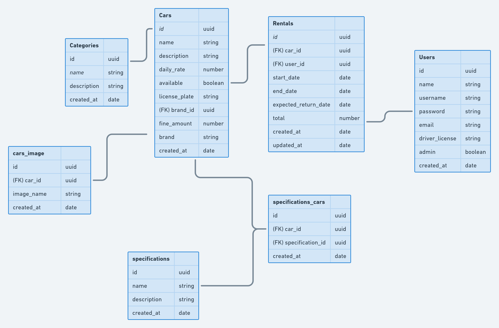

<h1 align="center">API Node.js par RentX</h1>

## Tecnologias

- [ESLint e Prettier](https://www.notion.so/ESLint-e-Prettier-Trilha-Node-js-d3f3ef576e7f45dfbbde5c25fa662779)
- [commitlint](https://commitlint.js.org/)
- [husky](https://yarnpkg.com/package/husky)
- [Express](https://expressjs.com/)
- [TypeScript](https://www.typescriptlang.org/)
- [ts-node-dev](https://yarnpkg.com/package/ts-node-dev)
- [multer](https://github.com/expressjs/multer)
- [CSV Parse](https://csv.js.org/parse/)
- [Swagger UI Express](https://yarnpkg.com/package/swagger-ui-express)
- [Docker](https://www.docker.com/)
- [Docker Compose](https://docs.docker.com/compose/)
- [TypeORM](https://typeorm.io/)
- [TSyringe](https://github.com/microsoft/tsyringe)
- [bcrypt](https://yarnpkg.com/package/bcrypt)
- [JWT](https://jwt.io/)
- [Jest](https://jestjs.io/)

---

## Iniciar projeto via Docker

### Criar e iniciar configurações

`docker-compose up`

### Iniciar serviços

`docker-compose start`

### logs

`docker logs SERVICE -f`

### Para serviços

`docker-compose stop`

### Para e remover as configurações

`docker-compose down`

---

## Diagramação

---

## Requisitos e Regras de negócio

- **RF**: Requisitos Funcionais;
- **RNF**: Requisitos Não Funcionais;
- **RN**: Regras de negócio.

### Cadastro de Carro
 
#### RF
- [x] Deve ser possível cadastro um novo carro.

#### RN
- [x] Não deve ser possível cadastro um carro com a placa já existente;
- [x] O carro pode padrão, deve ser cadastrado com disponível;
- [x] O usuário responsável pelo cadastro deve ser um administrado.

### Listagem de Carro
 
#### RF
- [x] Deve ser possível listar todos os carros disponíveis.
- [x] Deve ser possível listar todos os carros disponíveis através do nome da categoria;
- [x] Deve ser possível listar todos os carros disponíveis através do nome da marca;
- [x] Deve ser possível listar todos os carros disponíveis através do nome do carro.

#### RN
- [x] O usuário não precisa estar autenticado para lista os carros.

### Cadastro de especificação no carro
 
#### RF
- [ ] Deve ser possível cadastrar uma especificação para um carro;
- [ ] Deve ser possível listar todas as especificações;
- [ ] Deve ser possível listar todos os carros.

#### RN
- [ ] Não deve ser possível cadastrar uma especificação para um carro não cadastrado;
- [ ] Não deve ser possível cadastrar uma especificação já existente para o mesmo carro;
- [ ] O usuário responsável pelo cadastro deve ser um administrado.

### Cadastro de imagens do carro

#### RF
- [ ] Deve ser possível a imagem do carro;
- [ ] Deve ser possível listar todos os carros.

#### RNF
- [ ] Utilizar o multer para envio dos arquivos.

#### RN
- [ ] O usuário deve ser capaz de cadastrar mais de uma imagem para o mesmo carro;
- [ ] O usuário responsável pelo cadastro deve ser um administrado.

### Aluguel de carro

#### RF
- [ ] Deve ser possível cadastra um aluguel.

#### RN
- [ ] O aluguel deve ter duração minima de 24 hora;
- [ ] Não deve ser possível cadastrar um novo aluguel caso já exista um aberto para o mesmo usuário;
- [ ] Não deve ser possível cadastrar um novo aluguel caso já exista um aberto para o mesmo carro.
